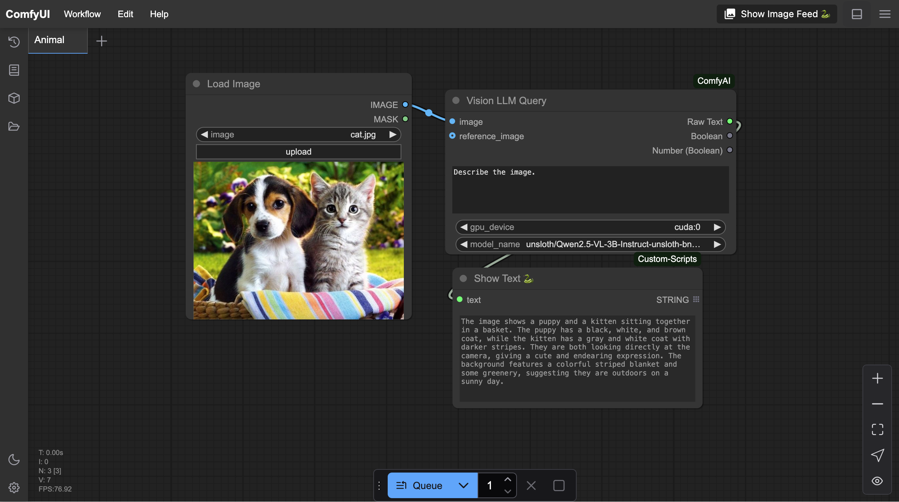
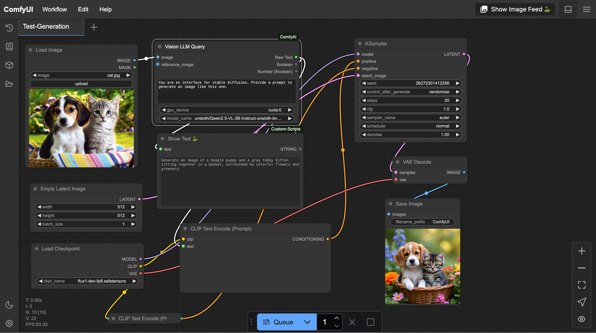
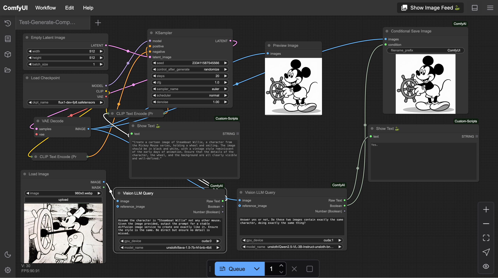

# **ComfyAI – LLM-Powered Vision & Text Query Node for ComfyUI**  

🚀 **ComfyAI** is an advanced **LLM-powered query node** for **ComfyUI**, enabling both **text-based and vision-based inference** using multimodal models like **Qwen-VL** and **Llava**.  

This project **isolates CUDA inference in a separate worker process**, ensuring that **ComfyUI remains stable even if CUDA crashes**.  

---

## **✨ Features**  

- ✅ **Text & Vision-Based LLM Inference** – Process **both images and text** in ComfyUI.  
- ✅ **Multimodal Model Support** – Works with **Qwen-VL**, **Llava**, and more.  
- ✅ **Stable & Resilient** – Runs inference in an **isolated worker process** to prevent UI crashes.  
- ✅ **Parallelized Processing** – Uses **multiprocessing** for fast, efficient LLM queries.  
- ✅ **Optimized Image Handling** – Minimizes memory usage with **controlled tokenization**.  

---

## **📌 Supported Models**  

Currently supported models:  
- **Qwen-2.5VL** (`qwen2_5_vl`) – Strong multimodal (text+vision) model.  
- **Llava** (`llava`) – Vision-language AI for image understanding.  

✅ **Recommended Model:**  
- **Llava-7B (bnb4) from Unsloth** – **Tested & performs exceptionally well!**  
- **Qwen2.5-VL-3B-Instruct (bnb4)** – Good, but **Llava-7B handles instructions significantly better.**  
- Supports **BitsAndBytes 4bit/8bit quantization** for efficiency.  

🚀 **Planned Support:**  
- **mLLaMA & Pixtral** – Requires additional integration (not yet implemented).  

---

## **📥 Installation**  

### **🔧 Prerequisites**  
Ensure you have the following installed:  
- **Python 3.10+**  
- **PyTorch with CUDA** (`torch + torchvision`)  
- **Hugging Face Transformers** (`transformers`)  
- **ComfyUI** (installed separately)  

### **📌 Install ComfyAI (from your ComfyUI installation folder)**  

```bash
cd custom_nodes
git clone https://github.com/mitchins/ComfyAI.git
cd ComfyAI
pip install -r requirements.txt
```

---

## **🚀 Usage**  

### **📌 Using the Query Node in ComfyUI**  

1. **Start ComfyUI** (ensure it’s installed and running).  
2. **Load the custom node from ComfyAI**.  
3. **Connect image/text inputs** and send queries.  
4. **The worker process handles inference asynchronously**.  

---

### **📌 Use Case 1 - Single Image → Text Output**  

To **describe an image**, pass it as `sample`. The `reference` input is only used for comparisons.  

**Example Workflow:**  
  

📝 **Example Prompt:**  
> *"You are an interface for stable diffusion. Provide a prompt to generate an image like this one."*  

---

### **📌 Use Case 2 - Comparing Two Images (Boolean Output)**  

The **Vision LLM** can compare **two images** and **output a True/False result**.  

**Example Workflow:**  
  

📝 **Example Prompt:**  
> *"Answer yes or no, are the following two images similarly themed?"*  

💡 **Tip:** This library includes a **`ConditionalSave` node**, which allows saving an image **only if a boolean condition is met**.  

---

### **📌 Use Case 3 - AI-Generated Prompt from an Image**  

The **Vision LLM** can generate text prompts **based on an input image**, making it useful for **Stable Diffusion automation**.  

**Example Workflow:**  
  

📝 **Example Prompt:**  
> *"Describe this image as a Stable Diffusion prompt."*  

**ComfyAI automatically writes a prompt**, which is then used to generate a similar image!  

---

### **📌 Use Case 4 - Combined Image Comparison + AI-Generated Prompt**  

This setup **first compares two images for similarity**, then **generates a Stable Diffusion prompt to recreate it**.  

**Example Workflow:**  
  

📝 **Example Prompt:**  
> *"Given the image provided, output the prompt for a Stable Diffusion image service to create one exactly like it. Ensure the style is the same. Be direct but ensure details are well-defined."*  

💡 **This is useful for**:  
- **Style transfer**  
- **Recreating an image in a different medium**  
- **Refining AI-generated art iteratively**  

---

## **🛠️ Configuration**  

### **🔍 Changing the Model**  
To use a different model, **select it inside the node in your ComfyUI workflow**.  

💡 **Example:**  
If you want to use a **Llava-7B model**, make sure it’s downloaded:  

```bash
huggingface-cli download unsloth/llava-1.5-7b-hf-bnb-4bit --all
```

Then, **select it inside the ComfyUI node settings**.  

---

### **📜 Logging**  
Logs are saved to `worker.log` in the package directory.  

📌 **Monitor logs in real-time:**  
```bash
tail -f custom_nodes/ComfyNodes/transformer_worker/worker.log
```

---

## **📅 Roadmap**  

🚀 **Planned improvements:**  
- ✅ **Expanding model support** (mLLaMA, Pixtral, ONNX models like Phi-3.5 Vision).  
- ✅ **Adding API-based inference** (Ollama, OpenAI endpoints).  
- ✅ **Performance optimizations** to further reduce memory usage.  

---

## **📜 License**  

This project is licensed under the **MIT License**. See `LICENSE` for details.  

---

## **🚀 Stay Updated**  

⭐ **Star this repo** if you find it useful!  
📣 **Issues, feedback, and contributions are welcome.**  

Happy coding! 🎨🤖  

